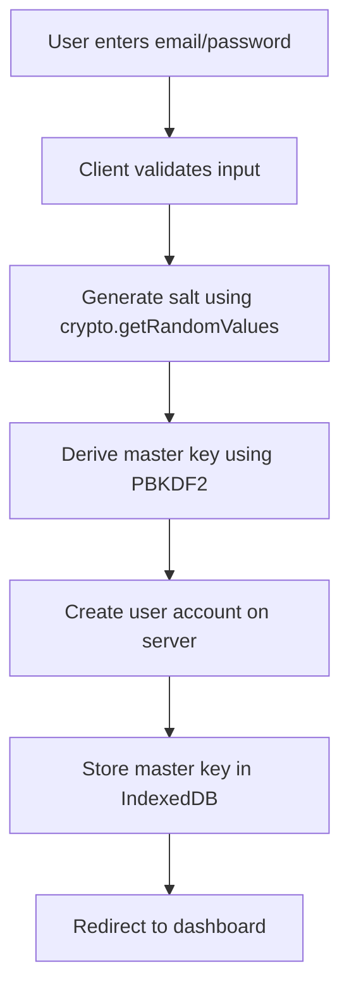
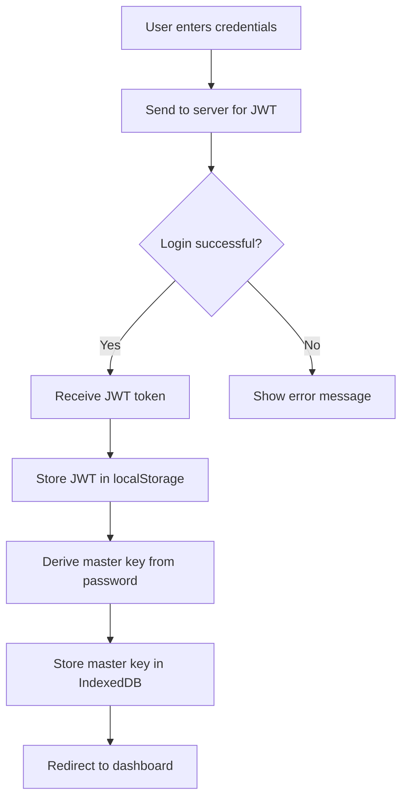
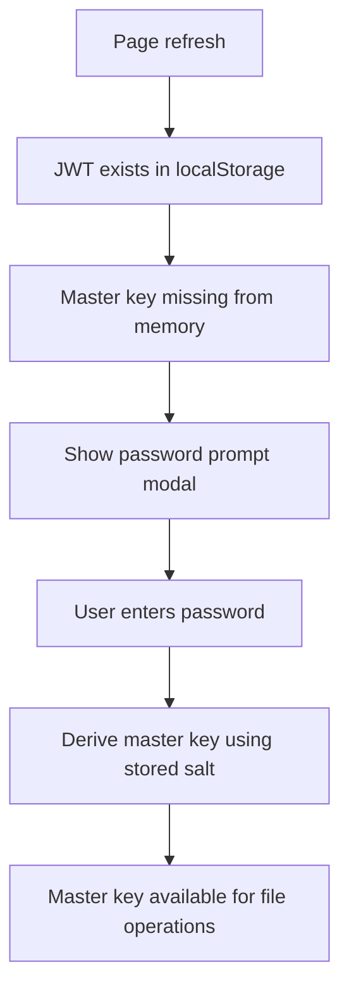
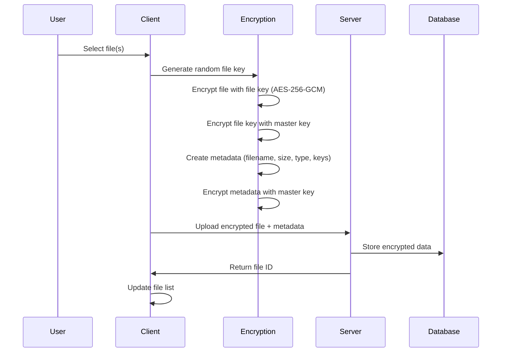
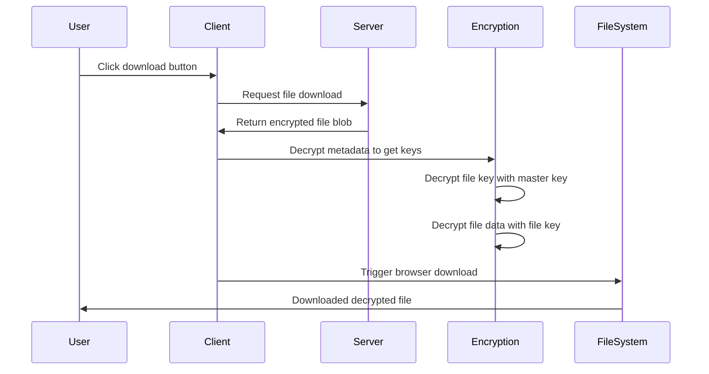

# Zero-Knowledge Encrypted Storage System - Complete Flow Documentation

## Table of Contents
1. [System Overview](#system-overview)
2. [Authentication Flow](#authentication-flow)
3. [Encryption Architecture](#encryption-architecture)
4. [File Upload Flow](#file-upload-flow)
5. [File Download Flow](#file-download-flow)
6. [Data Storage Strategy](#data-storage-strategy)
7. [Security Features](#security-features)
8. [Key Management](#key-management)
9. [Error Handling](#error-handling)
10. [State Management](#state-management)

## System Overview

This is a **Zero-Knowledge Encrypted Storage** system built with Next.js 14, where:
- All files are encrypted **client-side** before upload
- The server never sees unencrypted data
- Only the user with the correct password can decrypt their files
- Uses industry-standard encryption algorithms (AES-256-GCM, PBKDF2)

### Key Technologies Used
- **Frontend**: Next.js 14 with TypeScript, Tailwind CSS
- **State Management**: Zustand
- **Encryption**: Web Crypto API (AES-256-GCM, PBKDF2)
- **Storage**: IndexedDB (client-side), Server (encrypted data only)
- **Authentication**: JWT tokens

---

## Authentication Flow

### 1. User Registration (`/register`)



**What happens during registration:**

1. **Input Validation**: Email format and password strength checks
2. **Salt Generation**: 
   ```typescript
   const salt = crypto.getRandomValues(new Uint8Array(16)) // 16 random bytes
   ```
3. **Master Key Derivation**:
   ```typescript
   const masterKey = await crypto.subtle.deriveKey(
     {
       name: 'PBKDF2',
       salt: salt,
       iterations: 100000, // High iteration count for security
       hash: 'SHA-256'
     },
     passwordKey, // Derived from user's password
     { name: 'AES-GCM', length: 256 },
     true, // Extractable for storage
     ['encrypt', 'decrypt']
   )
   ```
4. **Server Registration**: Send email/password to server (password is hashed server-side)
5. **Key Storage**: Master key stored in IndexedDB for persistence

### 2. User Login (`/login`)



**What happens during login:**

1. **Server Authentication**: Credentials verified, JWT token returned
2. **Token Storage**: JWT stored in `localStorage` and cookies
3. **Master Key Recreation**: Same PBKDF2 process as registration to recreate the master key
4. **Key Persistence**: Master key stored in IndexedDB for session use

### 3. Password Prompt on Refresh

When the page refreshes, the user is authenticated (has JWT) but the master key is lost from memory:



---

## Encryption Architecture

### Core Encryption Components

#### 1. **Master Key** (User's Primary Key)
- **Derived from**: User's password + random salt using PBKDF2
- **Algorithm**: PBKDF2 with 100,000 iterations, SHA-256
- **Purpose**: Encrypts file keys and metadata
- **Storage**: IndexedDB (encrypted with session password)

#### 2. **File Keys** (Per-File Encryption)
- **Generated**: Random 256-bit key for each file
- **Algorithm**: AES-256-GCM
- **Purpose**: Encrypts individual files
- **Storage**: Encrypted with master key, stored in file metadata

#### 3. **Initialization Vectors (IVs)**
- **Generated**: Random 96-bit (12 bytes) for each encryption operation
- **Purpose**: Ensures same data encrypts differently each time
- **Storage**: Stored alongside encrypted data

### Encryption Layers

```
┌─────────────────────────────────────────┐
│           User Password                 │
├─────────────────────────────────────────┤
│          Master Key (PBKDF2)            │
├─────────────────────────────────────────┤
│         File Keys (AES-256-GCM)         │
├─────────────────────────────────────────┤
│        File Data (AES-256-GCM)          │
└─────────────────────────────────────────┘
```

---

## File Upload Flow

### Detailed Upload Process



### Step-by-Step Upload Process

#### 1. **File Selection & Reading**
```typescript
const file = event.target.files[0]
const fileBuffer = await file.arrayBuffer()
```

#### 2. **File Key Generation**
```typescript
const fileKey = await crypto.subtle.generateKey(
  { name: 'AES-GCM', length: 256 },
  true,
  ['encrypt', 'decrypt']
)
```

#### 3. **File Encryption**
```typescript
const fileIV = crypto.getRandomValues(new Uint8Array(12))
const encryptedFileData = await crypto.subtle.encrypt(
  { name: 'AES-GCM', iv: fileIV },
  fileKey,
  fileBuffer
)
```

#### 4. **File Key Encryption**
```typescript
const keyIV = crypto.getRandomValues(new Uint8Array(12))
const exportedFileKey = await crypto.subtle.exportKey('raw', fileKey)
const encryptedFileKey = await crypto.subtle.encrypt(
  { name: 'AES-GCM', iv: keyIV },
  masterKey,
  exportedFileKey
)
```

#### 5. **Metadata Creation & Encryption**
```typescript
const metadata = {
  filename: file.name,
  size: file.size,
  mimeType: file.type,
  encryptedKey: base64(encryptedFileKey),
  iv: base64(fileIV),
  salt: base64(keyIV)
}
const encryptedMetadata = await encryptMetadata(metadata, masterKey)
```

#### 6. **Base64 Conversion (Chunked)**
Large files are converted to base64 in chunks to avoid stack overflow:
```typescript
const chunkSize = 32768 // 32KB chunks
for (let i = 0; i < bytes.length; i += chunkSize) {
  const chunk = bytes.slice(i, i + chunkSize)
  result += String.fromCharCode(...chunk)
}
return btoa(result)
```

#### 7. **Server Upload**
```typescript
const formData = new FormData()
formData.append('file', encryptedBlob)
formData.append('encrypted_filename', encryptedFilename)
formData.append('encrypted_metadata', encryptedMetadata)
formData.append('file_size', originalSize)
```

---

## File Download Flow

### Detailed Download Process



### Step-by-Step Download Process

#### 1. **File Request**
```typescript
const encryptedFileBlob = await filesApi.downloadFile(fileId)
```

#### 2. **Metadata Decryption**
```typescript
const metadata = await decryptMetadata(file.encrypted_metadata, masterKey)
// Contains: filename, size, mimeType, encryptedKey, iv, salt
```

#### 3. **ArrayBuffer Conversion**
```typescript
const encryptedDataBuffer = await encryptedFileBlob.arrayBuffer()
```

#### 4. **Key Reconstruction**
```typescript
const encryptedKeyBuffer = base64ToUint8Array(metadata.encryptedKey).buffer
const keyIV = base64ToUint8Array(metadata.salt).buffer
const fileIV = base64ToUint8Array(metadata.iv).buffer

// Decrypt file key
const decryptedFileKeyBuffer = await crypto.subtle.decrypt(
  { name: 'AES-GCM', iv: keyIV },
  masterKey,
  encryptedKeyBuffer
)
```

#### 5. **File Key Import**
```typescript
const fileKey = await crypto.subtle.importKey(
  'raw',
  decryptedFileKeyBuffer,
  { name: 'AES-GCM' },
  false,
  ['decrypt']
)
```

#### 6. **File Decryption**
```typescript
const decryptedFileBuffer = await crypto.subtle.decrypt(
  { name: 'AES-GCM', iv: fileIV },
  fileKey,
  encryptedDataBuffer
)
```

#### 7. **File Download Trigger**
```typescript
const blob = new Blob([decryptedFileBuffer], { type: mimeType })
const url = URL.createObjectURL(blob)
const link = document.createElement('a')
link.href = url
link.download = filename
link.click()
```

---

## Data Storage Strategy

### Client-Side Storage (IndexedDB)

**What's Stored:**
```typescript
interface StoredKeyData {
  salt: Uint8Array,           // For master key derivation
  encryptedKey: string,       // Master key encrypted with session password
  iv: Uint8Array             // IV for master key encryption
}
```

**Why IndexedDB:**
- Persistent across browser sessions
- Can store binary data (Uint8Array)
- Larger storage capacity than localStorage
- Encrypted before storage

### Server-Side Storage

**What's Stored on Server:**
```typescript
interface ServerFileData {
  id: string,
  user_id: string,
  encrypted_filename: string,     // Filename encrypted with master key
  encrypted_metadata: string,     // All metadata encrypted with master key
  file_data: Buffer,             // File encrypted with file key
  file_size: number,             // Original file size
  uploaded_at: timestamp,
  last_accessed: timestamp
}
```

**What Server NEVER Sees:**
- User passwords (only hashes)
- Master keys
- File keys
- Unencrypted filenames
- Unencrypted file content
- Unencrypted metadata

---

## Security Features

### 1. **Zero-Knowledge Architecture**
- Server cannot decrypt any user data
- All encryption/decryption happens client-side
- Server only stores encrypted blobs

### 2. **Defense Against Common Attacks**

#### **Rainbow Table Attacks**
- **Protection**: Random salt per user for PBKDF2
- **Implementation**: `crypto.getRandomValues(new Uint8Array(16))`

#### **Brute Force Attacks**
- **Protection**: High PBKDF2 iteration count (100,000)
- **Effect**: Makes password cracking computationally expensive

#### **Padding Oracle Attacks**
- **Protection**: AES-GCM provides authenticated encryption
- **Benefit**: Built-in integrity verification

#### **Replay Attacks**
- **Protection**: Random IV for each encryption operation
- **Effect**: Same data encrypts differently each time

### 3. **Key Rotation Support**
Each file has its own encryption key, enabling:
- Individual file key rotation
- Master key changes without re-encrypting all files
- Granular access control

---

## Key Management

### Key Hierarchy

```
User Password
    ↓ (PBKDF2)
Master Key ────────┬─→ Encrypts File Key 1 ─→ Encrypts File 1
                   ├─→ Encrypts File Key 2 ─→ Encrypts File 2
                   ├─→ Encrypts File Key N ─→ Encrypts File N
                   └─→ Encrypts Metadata
```

### Key Lifecycle

#### **Master Key**
1. **Creation**: During registration from password + salt
2. **Storage**: IndexedDB (encrypted with session password)
3. **Retrieval**: Re-derived on login or from IndexedDB
4. **Usage**: Encrypts/decrypts file keys and metadata
5. **Destruction**: Removed from memory on logout

#### **File Keys**
1. **Generation**: Random 256-bit key per file
2. **Usage**: Encrypt/decrypt individual files
3. **Protection**: Encrypted with master key
4. **Storage**: In encrypted metadata
5. **Lifetime**: Permanent (stored with file)

### Password Security

#### **Hashing Strategy (Server-Side)**
```typescript
// Server hashes password with bcrypt (assumed)
const hashedPassword = await bcrypt.hash(password, 12)
```

#### **Key Derivation (Client-Side)**
```typescript
const masterKey = await crypto.subtle.deriveKey(
  {
    name: 'PBKDF2',
    salt: userSalt,
    iterations: 100000,
    hash: 'SHA-256'
  },
  passwordKey,
  { name: 'AES-GCM', length: 256 },
  true,
  ['encrypt', 'decrypt']
)
```

---

## Error Handling

### Encryption Errors

#### **Stack Overflow Prevention**
**Problem**: Large files cause stack overflow with `String.fromCharCode(...largeArray)`
**Solution**: Chunked processing
```typescript
const chunkSize = 32768 // 32KB chunks
for (let i = 0; i < bytes.length; i += chunkSize) {
  const chunk = bytes.slice(i, i + chunkSize)
  result += String.fromCharCode(...chunk)
}
```

#### **Invalid Base64 Handling**
**Problem**: Malformed base64 causes decryption failures
**Solution**: Validation and error recovery
```typescript
const base64Regex = /^[A-Za-z0-9+/]*={0,2}$/
if (!base64Regex.test(base64String)) {
  throw new Error('Invalid base64 format')
}
```

#### **Legacy File Support**
**Problem**: Files uploaded before metadata format changes
**Solution**: Graceful degradation
```typescript
try {
  const metadata = await decryptMetadata(encryptedMetadata, masterKey)
  return metadata
} catch (error) {
  console.warn('Legacy file detected, using defaults')
  return {
    filename: 'Legacy File',
    size: 0,
    mimeType: 'application/octet-stream'
  }
}
```

### Authentication Errors

#### **Master Key Recovery**
When master key is lost after page refresh:
1. Show password prompt modal
2. Re-derive master key from password
3. Validate key by attempting metadata decryption
4. Store key in memory for session

#### **Token Refresh**
JWT token automatic renewal:
```typescript
// Middleware checks token expiry
if (token.exp < Date.now()) {
  await refreshToken()
}
```

---

## State Management

### Zustand Stores

#### **Auth Store** (`authStore.ts`)
```typescript
interface AuthState {
  user: User | null
  token: string | null
  masterKey: CryptoKey | null
  isAuthenticated: boolean
  
  // Actions
  login: (credentials) => Promise<void>
  logout: () => void
  initialize: () => Promise<void>
}
```

#### **File Store** (`fileStore.ts`)
```typescript
interface FileState {
  files: FileMetadata[]
  uploadStates: FileUploadState
  
  // Actions
  uploadFile: (file: File) => Promise<void>
  downloadFile: (fileId: string) => Promise<void>
  fetchFiles: () => Promise<void>
  deleteFile: (fileId: string) => Promise<void>
}
```

### State Persistence

#### **Authentication State**
- **JWT Token**: localStorage + HTTP-only cookies
- **User Info**: localStorage
- **Master Key**: IndexedDB (encrypted)

#### **File State**
- **File List**: Memory only (refreshed from server)
- **Upload Progress**: Memory only (temporary)

---

## API Integration

### File Upload API
```typescript
POST /api/files/upload
Content-Type: multipart/form-data

FormData:
- file: Blob (encrypted file data)
- encrypted_filename: string
- encrypted_metadata: string (contains keys + file info)
- file_size: number (original size)
```

### File Download API
```typescript
GET /api/files/{fileId}/download
Response: Blob (encrypted file data)

GET /api/files/{fileId}
Response: {
  id: string,
  encrypted_filename: string,
  encrypted_metadata: string,
  file_size: number,
  uploaded_at: string
}
```

### File List API
```typescript
GET /api/files?page=1&limit=20
Response: {
  files: FileMetadata[],
  pagination: {
    total: number,
    page: number,
    limit: number,
    total_pages: number
  }
}
```

---

## Performance Optimizations

### 1. **Chunked Processing**
- File encryption in 32KB chunks
- Base64 conversion in chunks
- Prevents memory overflow and stack overflow

### 2. **Lazy Loading**
- Files loaded on demand
- Metadata decrypted only when needed
- Progressive loading for large file lists

### 3. **Caching Strategy**
- Master key cached in memory during session
- File list cached until refresh
- Metadata cache for frequently accessed files

### 4. **Background Operations**
- File uploads in background
- Progress tracking for user feedback
- Non-blocking UI during encryption

---

## Security Considerations

### What Makes This System Secure

1. **Client-Side Encryption**: Server never sees plaintext
2. **Strong Algorithms**: AES-256-GCM, PBKDF2 with high iterations
3. **Random IVs**: Each encryption operation uses unique IV
4. **Key Separation**: Each file has its own encryption key
5. **Zero-Knowledge**: Server cannot decrypt user data even if compromised

### Potential Vulnerabilities & Mitigations

#### **Client-Side Attacks**
- **Risk**: XSS attacks could steal keys from memory
- **Mitigation**: Content Security Policy, input sanitization

#### **Side-Channel Attacks**
- **Risk**: Timing attacks on encryption operations
- **Mitigation**: Constant-time operations where possible

#### **Password Attacks**
- **Risk**: Weak passwords can be brute-forced
- **Mitigation**: Password strength requirements, high PBKDF2 iterations

#### **Browser Security**
- **Risk**: Browser vulnerabilities could expose keys
- **Mitigation**: Regular updates, secure contexts (HTTPS only)

---

## Development & Debugging

### Debug Modes
```typescript
// Enable encryption debugging
console.log('Encrypting file:', file.name)
console.log('Generated IV:', Array.from(iv))
console.log('Encrypted size:', encryptedData.byteLength)
```

### Error Logging
```typescript
try {
  await encryptFile(file, masterKey)
} catch (error) {
  console.error('Encryption failed:', {
    fileName: file.name,
    fileSize: file.size,
    error: error.message,
    stack: error.stack
  })
  throw error
}
```

### Performance Monitoring
```typescript
const start = performance.now()
await encryptFile(file, masterKey)
const duration = performance.now() - start
console.log(`Encryption took ${duration}ms for ${file.size} bytes`)
```

---

## Conclusion

This zero-knowledge encrypted storage system provides:
- **Maximum Security**: Client-side encryption with industry standards
- **User Privacy**: Server cannot access user data
- **Scalability**: Per-file encryption keys enable efficient operations
- **Reliability**: Robust error handling and legacy file support
- **Performance**: Optimized for large files with chunked processing

The system successfully implements the principle of zero-knowledge storage, where the service provider cannot access user data even if they wanted to, making it suitable for storing sensitive documents, personal files, and confidential information.